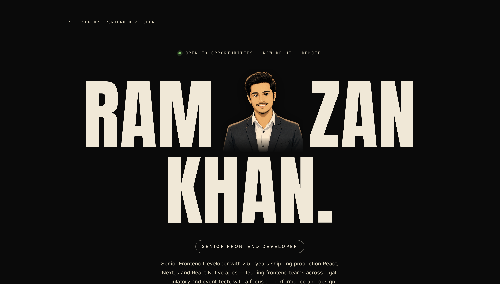

# Ramzan Khan — Portfolio

The personal portfolio of **Ramzan Khan**, a Senior Frontend Developer based in **New Delhi**, currently leading frontend on three flagship products at Wasserstoff.

This site is the long-form version of a resume — built to give recruiters, founders, and collaborators the full picture in under two minutes of scanning.

**🌐 Live:** [ramzan-khan.netlify.app](https://ramzan-khan.netlify.app/)
**📄 CV / Resume:** [View PDF](https://drive.google.com/file/d/1TLn9o7L3Lt-CHDUcaPUpIA6K6cosBXhE/view?usp=share_link)

---

## About Ramzan

Senior Frontend Developer with **2.5+ years** shipping production React, Next.js and React Native apps across **legal, regulatory, and event-tech** domains. Currently leading a team of 4 developers and mentoring 10+ interns at **Wasserstoff Innovation & Learning Labs**.

Strong focus on:

- Frontend **architecture** for non-trivial products (multi-tenant, real-time, payment-gated)
- **Performance** — cut load times by 45% on flagship apps via SSR, code-splitting, lazy loading
- **Design systems** — established shared UI patterns across three products
- **Team velocity** — code review, PR quality, deployment ownership

Based in **New Delhi, IN**. Open to senior frontend roles, freelance product work, and frontend-architecture consulting. Comfortable working remote across timezones.

**Reach out:** [ramzanformasai03@gmail.com](mailto:ramzanformasai03@gmail.com) · [LinkedIn](https://www.linkedin.com/in/ramzan01/) · [GitHub](https://github.com/mr-ramzan01)

---

## Selected work

Three flagship products architected and shipped end-to-end at Wasserstoff.

### Lit Law — Legal AI Assistant & AI Paralegal

An AI legal research platform covering **9 countries**, supporting **legal research, document drafting, and compliance workflows** for legal professionals and students. All answers are backed by verified citations.

- Architected the Next.js frontend with SSR, code-splitting, and lazy loading — **45% load-time reduction** and improved SEO discoverability
- Integrated **Cashfree** and **PayU** for subscription billing
- Integrated **Server-Sent Events (SSE)** for real-time streaming of LLM responses

→ [app.litt.law](https://app.litt.law)

### Astrix — Event Ticketing & Engagement Platform

An event discovery and ticketing platform built end-to-end — connecting artists with fans through browse, calendar, and map-based event exploration.

- Implemented an **XP-based engagement system** with points redeemable for ticket discounts, boosting user retention and repeat purchases
- Integrated **Razorpay** and **PayU** for ticket payments
- Built **end-to-end type-safe APIs with tRPC** across event discovery and checkout flows

→ [astrix.live](https://www.astrix.live/)

### Lit Reg — LLM-Based Regulatory Intelligence Platform

A regulatory intelligence platform for compliance and legal teams — navigating filings from **SEBI, RBI, and SAT** through an LLM-powered interface.

- Developed a **Google Drive-style file/folder management system** with drag-and-drop uploads, inline metadata editing, and real-time PDF rendering
- Built **modal-based PDF previews and side-by-side folder navigation** in TypeScript, letting compliance teams cross-reference filings without leaving the workspace

→ [reg.lit.law](https://reg.lit.law)

---

## Experience

**Senior Frontend Developer · Wasserstoff Innovation & Learning Labs Pvt. Ltd.**
*Mar 2024 — Present · Gurugram, Haryana*

- Architected and shipped three flagship products (Lit Law, Lit Reg, Astrix) end-to-end using Next.js, React, TypeScript, and React Native
- Led a team of 4 developers and mentored 10+ interns
- Reduced app load time by 45% via code-splitting, lazy loading, SSR, and frontend performance optimizations
- Integrated Razorpay, Cashfree, and PayU across products to power subscriptions and ticket payments

**Full Stack Web Developer · BrainVibs Technologies Pvt. Ltd.**
*Sep 2023 — Feb 2024 · New Delhi*

- Built a React Flow-based visual editor for WhatsApp Business chatbots, letting non-technical users design conversational flows without writing code
- Built a multi-provider email service integrating 5+ SMTPs (SendGrid, Mailgun, AWS SES, Brevo) with dynamic templates, queuing, and provider failover

---

## Education & certifications

**Bachelor of Computer Applications (BCA)** — Indira Gandhi National Open University (IGNOU)
*Pursuing · Expected 2028*

**Full Stack Web Development** — Masai School
*Feb 2022 — Dec 2022 — 1200+ hour intensive program covering MERN stack, DSA, and system design*

---

## Design philosophy

The portfolio itself is intended to be a work sample. A few intentional choices:

- **Dark canvas, cream type** — a single fixed theme. No light/dark toggle. Confident, opinionated.
- **Editorial layout** — each section sits inside a "page frame" with mono strips top and bottom, like a magazine or print specimen. Recruiters move between sections feeling like they're flipping pages.
- **Anton display type** for headlines — heavy condensed sans, instantly memorable. Paired with Fraunces italic for serif accents (project subtitles, kickers) and Inter for body.
- **Anime portrait integrated into the name** — instead of a separate headshot card, the portrait sits *between* RAM and ZAN in the hero title. A small distinctive move that humanizes the page without dominating it.
- **Anti-bloat skills list** — only tech genuinely used in production. No HTML5/CSS3 padding, no process tools, no "responsive design" filler.
- **No copy-paste resume content** — every bullet is rewritten for the portfolio voice (concrete, outcome-led, no buzzwords).

---

## Tech notes

For the curious — built with **Vite + React + TypeScript** and CSS Modules. Intentionally small dependency footprint (no Tailwind, no UI library, no Redux). Deployed on **Netlify**. Source lives in the `my_portfolio/` directory of this repo.

---

*Last updated: June 2026*
